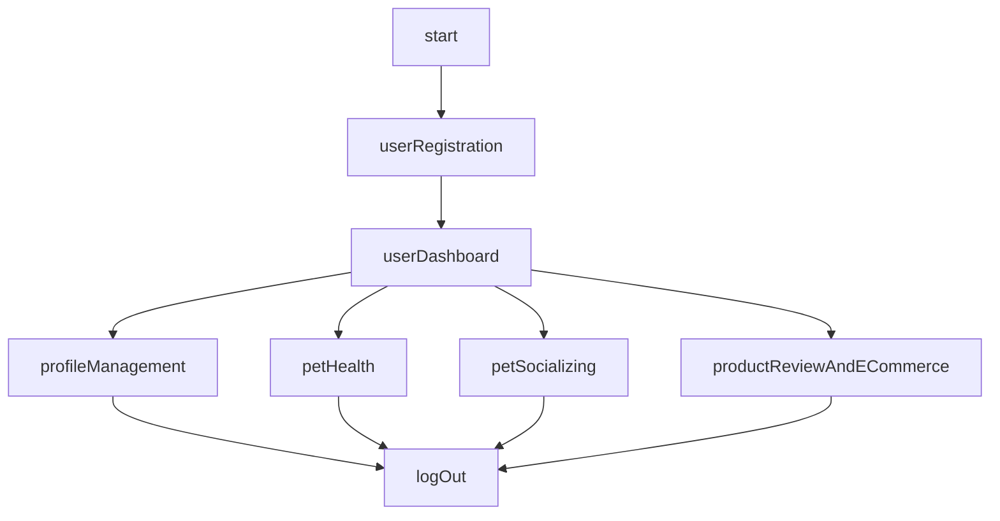
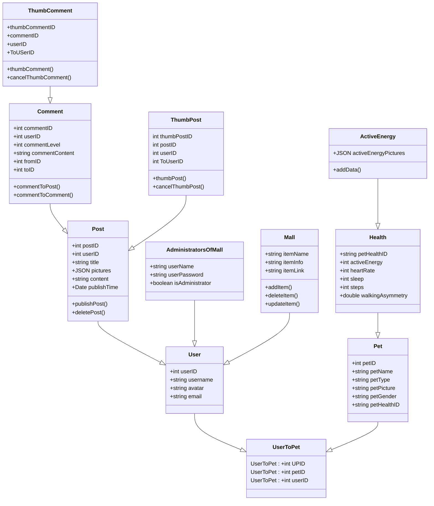

# Final Project
# Software Requirement Specification for Group Fantastic Four

Group member:

Hao Luo, Xu Tan, Xuan Lei, Guodong Mao

## Purpose:

1. Definitions: "Sweet Pets" is a comprehensive pet community application designed for cat and dog enthusiasts, mainly targeting pet owner.

2. Background: 66% of American households own pets, which translates to approximately 86.9 million households. Some of them even have multiple pets. Among them, there are 65.1 million households with dogs and 46.5 million households with cats. So the population of pet owners in the US is insane.

## Overall Description:

#### User Characteristics:

- Pet owners(commercial or non-commercial ), willing to share their pets online, willing to make friends(both for pets & owners)

#### User Stories:

- As a user, I want to have a registration feature so that I can create an account using my email and create my own profiles.

- As a pet owner, I want to have a profile creation feature so that I can create and manage profiles for each of my pets, including their names, breeds, ages, and photos.

- As a pet owner, I would like to have a feature for sharing my pets' daily life. This way, I can post adorable daily photos of my pets with the pet community, fostering connections and making new friends. It enables me to interact and socialize with fellow pet owners while also receiving likes and comments, enhancing the sense of community and engagement.

- As a pet owner, I want to record my pet's daily sleep time, number of steps, active energy, caloric intake from their food and so on.

- As a pet owner, I hope to have a pet shopping mall in this app so that I can find the pet products information, such as food, toys, medications, and other items.And it can provide me with  the links that are related to other marketplaces where I can buy them.

#### App Workflow (flowchart)

## Requirements:

#### Functional:

1. User Registration: Users must be able to create accounts using email addresses.

2. Profile Management: Users can create and manage multiple pet profiles, including information such as the pet's name, breed, age, gender, photos, and more.

3. Editing: Pet profiles should have editing and deleting capabilities, allowing users to update information at any time.

4. Pet Daily Sharing: Users can share their pets' daily photos and stories within the application. Users can add text descriptions and tags to explain the content of their shares.

5. Users can browse and interact with these shares by liking and commenting.

6. Pet Health: Pet owners can track their pet's daily sleep duration, number of steps taken, active energy, and caloric intake from food to maintain a daily record of their pet's health status.

7. Product Catalog: The app should have a complete product catalog, including various pet supplies such as food, toys, medications, and other items.

8. Product Details: Users should be able to view detailed information about each product, including product descriptions, prices, and other relevant information. Additionally, there should be links to these products on Amazon, Petco, or Petsmart.

9. Search Function: The app must provide a search function, allowing users to easily find specific pet supplies by entering keywords or applying filtering criteria.

#### Non-functional:

##### Performance Requirements:

1. Fast Response Time: Ensure that the application has a fast response time to enhance user experience.

2. Scalability: Design the application to handle an increasing number of users, ensuring stability even during high traffic loads.

3. Smoothness: Ensure that after using the APP for a period of time, the animation of the APP sliding operation is still smooth.

##### User Experience Requirements:

1. Intuitive Interface: Design the user interface to simplify user operations and navigation, making it user-friendly.

2. Mobile-Friendly: Ensure that the application's interface and features work seamlessly on mobile devices to meet the needs of mobile users.

##### Availability Requirements:

1. 24/7 Availability: Maintain the application's availability round the clock to accommodate users from different time zones and schedules.

2. Accessibility: Ensure that the application is accessible and usable for users with special needs, including those with visual, auditory, or mobility impairments.

3. Security: The app should ensure user privacy and data security.

## Wireframe

[Link to Figma](https://www.figma.com/file/78ZtKw4L9yxla978XeZEFU/Sweet-Pet?type=design&node-id=210%3A2008&mode=design&t=rnyde130V5gGQ33J-1)

## UML

## Gantt Diagram

## Traceability Matrix
| Requirement ID | Requirement Description | Test/Feature |
|---------------|-------------------------|-------------|
| REQ-001       | User Registration: Users must be able to create accounts using email addresses. | User Registration Feature |
| REQ-002       | Profile Management: Users can create and manage multiple pet profiles, including information such as the pet's name, breed, age, gender, photos, and more. | Profile Management Feature |
| REQ-003       | Editing: Pet profiles should have editing and deleting capabilities, allowing users to update information at any time. | Profile Editing and Deletion Feature |
| REQ-004       | Pet Daily Sharing: Users can share their pets' daily photos and stories within the application. Users can add text descriptions and tags to explain the content of their shares. | Pet Daily Sharing Feature |
| REQ-005       | Users can browse and interact with these shares by liking and commenting. | Like and Comment on Pet Shares Feature |
| REQ-006       | Pet Adoption: Prospective pet adopters can browse the list of pets available for adoption on the pet adoption platform. | Pet Adoption Feature |
| REQ-007       | Pet owners can post and edit adoption messages, including contact information, photos, descriptions, and adoption requirements, to find new homes for their pets. | Adoption Message Posting and Editing Feature |
| REQ-008       | Pet Health: Users can post their experiences in treating their pets, including treatment methods and medication recommendations. And other users can also review them. | Pet Health Sharing Feature |
| REQ-009       | Users can search for nearby pet clinics and read user reviews to ensure that their pets receive the best medical care. Similarly, users can also leave comments on these clinics. | Pet Clinic Search and Review Feature |
| REQ-010       | Product Catalog: The app should have a complete product catalog, including various pet supplies such as food, toys, medications, and other items. | Product Catalog Feature |
| REQ-011       | Product Details: Users should be able to view detailed information about each product, including product descriptions, prices, available sizes, and other relevant information. Additionally, there should be links to these products on Amazon, Petco, or Petsmart. | Product Details Feature |
| REQ-012       | Search Function: The app must provide a search function, allowing users to easily find specific pet supplies by entering keywords or applying filtering criteria. | Search Function for Pet Supplies Feature |
| REQ-013       | Shopping Cart: Users should be able to add products to their shopping cart, review the cart contents, and proceed to checkout. | Shopping Cart and Checkout Feature |
| REQ-014       | Ratings: Users should be able to leave ratings for products to assist others in making informed purchase decisions. | Product Ratings Feature |

## Instructions

Your team's code and documentation will be here.
